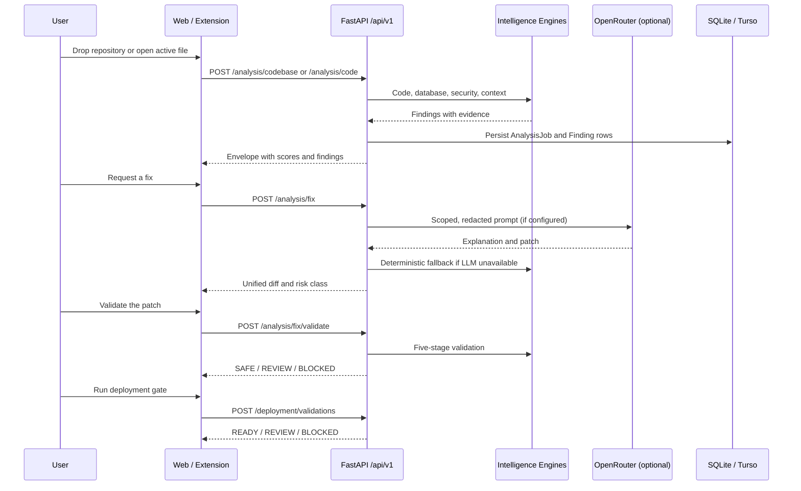
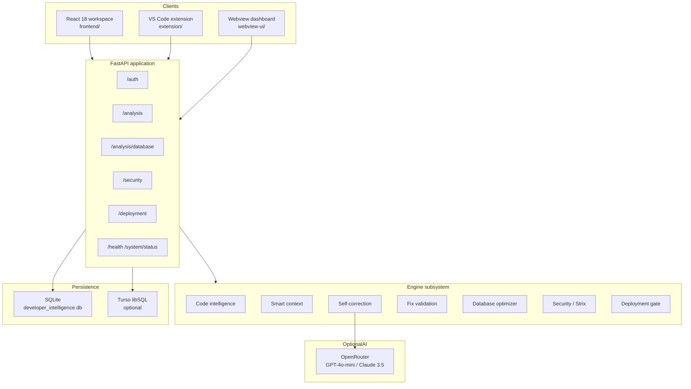
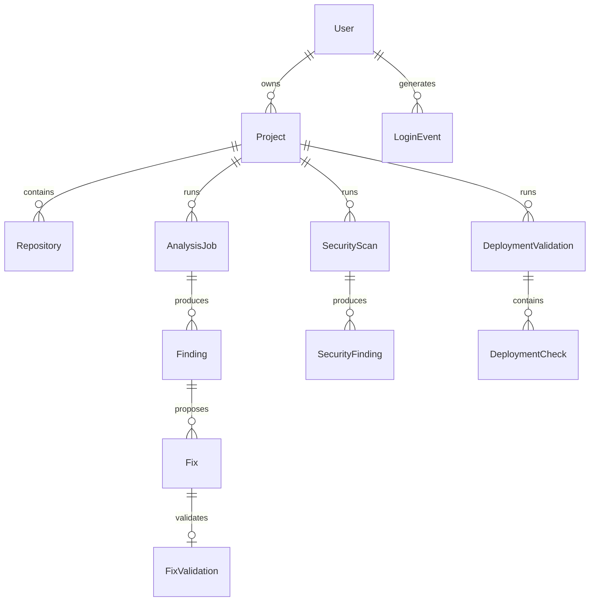

# Developer Intelligence Platform

**Smarter development. Safer deployments.**

An AI-assisted developer productivity platform that unifies code quality analysis, database performance profiling, security pentesting, automated patch generation, and deployment readiness checks into a single evidence-first workflow.

The platform is designed for teams that currently assemble this picture from five or six disconnected tools: a linter, an APM product, a database profiler, a secret scanner, and a CI gate. Developer Intelligence correlates those layers, explains the finding in context, proposes a guarded patch, and verifies the change before it reaches production.

```
Scan → Detect → Explain → Recommend → Fix → Verify → Deploy
```

| Layer | What the platform evaluates |
| :--- | :--- |
| Application code | AST defects, complexity, null safety, leak patterns |
| Database access | Slow queries, missing indexes, N+1 ORM loops |
| Security posture | Injection, secrets, CVEs, container hardening |
| Release readiness | Seven deployment pillars and a go / review / block decision |
| Generated patches | Five-stage validation before a fix is marked safe |

---

## Table of contents

1. [Executive summary](#1-executive-summary)
2. [Who this platform is for](#2-who-this-platform-is-for)
3. [Product capabilities](#3-product-capabilities)
4. [Core diagnostic workflow](#4-core-diagnostic-workflow)
5. [Design principles](#5-design-principles)
6. [System architecture](#6-system-architecture)
7. [Intelligence engines](#7-intelligence-engines)
8. [Client applications](#8-client-applications)
9. [Data model](#9-data-model)
10. [Authentication and session model](#10-authentication-and-session-model)
11. [API reference](#11-api-reference)
12. [Repository structure](#12-repository-structure)
13. [Technology stack](#13-technology-stack)
14. [Environment configuration](#14-environment-configuration)
15. [Local development](#15-local-development)
16. [Demo repositories](#16-demo-repositories)
17. [Testing and verification](#17-testing-and-verification)
18. [Production deployment](#18-production-deployment)
19. [Operations and health](#19-operations-and-health)
20. [Security and privacy](#20-security-and-privacy)
21. [Troubleshooting](#21-troubleshooting)
22. [Project status and attribution](#22-project-status-and-attribution)

---

## 1. Executive summary

Modern engineering teams do not fail because they lack scanners. They fail because each scanner reports a different slice of the truth:

- A linter flags a style issue but cannot see that the same function issues an unindexed query on every request.
- A database tool reports 420 ms latency but cannot show that a frontend retry loop is multiplying the query.
- A secret scanner lists a token, but not whether the surrounding auth path also accepts unverified JWTs.
- A CI job fails a dependency audit after the patch that “fixed” a null reference introduced a new injection sink.

Developer Intelligence is built around a single operating idea: **findings must be correlated, explained, and gated**. A result is not complete until it includes:

1. The defect and its evidence.
2. The layer it belongs to (code, data, security, or release).
3. A recommended change with a unified diff.
4. A validation score that says whether the change is safe to apply.

The system is implemented as a FastAPI service, a React 18 workspace, a VS Code extension, and a standalone webview dashboard. Analysis engines run locally with deterministic fallbacks. Optional cloud services (OpenRouter for language-model reasoning and Turso for libSQL synchronization) extend the same contract without changing the client API.

The current implementation was developed for the **Smart India Hackathon (SIH 2026)** Developer Intelligence track.

---

## 2. Who this platform is for

| Audience | How they use the platform |
| :--- | :--- |
| Backend and full-stack engineers | Drop a repository or file, review findings, inspect diffs, and apply validated fixes. |
| Security reviewers | Run Strix scans, inspect PoC payloads, and confirm that a patch did not introduce a new sink. |
| Database-minded developers | Profile SQL and ORM usage, compare baseline versus optimized latency, and receive exact `CREATE INDEX` statements. |
| Release owners | Run the seven-pillar deployment gate and receive a `READY`, `REVIEW`, or `BLOCKED` decision. |
| Hackathon judges and evaluators | Use the pre-seeded demo repositories and the end-to-end demonstration script. |
| Platform operators | Monitor `/api/v1/health` and `/api/v1/system/status`, and optionally attach Turso for cloud persistence. |

The product is useful both as a hosted web application and as an IDE-native sidebar. The same REST contract backs both surfaces.

---

## 3. Product capabilities

### 3.1 Code intelligence

The code engine inspects Python through the standard `ast` module and applies targeted semantic checks to JavaScript and TypeScript sources. Typical findings include:

- Attribute access on values that may be `None` after `get`, `filter`, `first`, or `find`.
- Unbounded in-memory caches and dictionaries with no eviction or TTL.
- Functions whose cyclomatic complexity exceeds a conservative branch threshold.
- Syntax errors reported with file, line, and column precision.
- Unchecked DOM lookups and promises that are never rejected safely.

Each finding is stored with severity, confidence, evidence, and a stable identifier so later fix and validation steps can attach to it.

### 3.2 Smart repository context

Language-model calls are expensive and unsafe when an entire repository is uploaded. The context engine therefore extracts the smallest useful slice of the project:

| Level | Scope | Token budget |
| :--- | :--- | :--- |
| 1 | Immediate block around the active line | ≤ 200 |
| 2 | Enclosing function, method, or class plus imports | ≤ 600 |
| 3 | Companion files, imported symbols, and active diff hunks | ≤ 1,200 |
| 4 | Project topology: manifests, Dockerfiles, schema files | ≤ 2,048 |

Before any payload is sent to an external model, high-entropy strings and known secret patterns are redacted.

### 3.3 Self-correction

When a finding is selected for repair, the self-correction engine produces:

- A root-cause explanation.
- A step-by-step narrative of the intended change.
- A unified diff suitable for human review.
- Before / after source fragments.
- A confidence score and a risk class of `LOW`, `MEDIUM`, or `HIGH`.

If OpenRouter is configured, the engine can ask GPT-4o-mini (with Claude 3.5 Sonnet as fallback). If the key is missing or the provider is unreachable, deterministic local templates still produce a reviewable patch. The platform never silently overwrites a file without an apply step.

### 3.4 Database optimization

The database engine extracts SQL from `.sql` files, Python sources, TypeScript sources, and common ORM patterns. It then:

- Estimates baseline versus optimized latency from table size, `SELECT *`, filter clauses, and sort operations.
- Emits concrete index DDL for single-column and composite access paths.
- Flags N+1 query loops and unindexed `WHERE` / `ORDER BY` usage.

If a project contains no schema and no queries, the engine reports a clean posture with zero slow queries. It does not invent database problems to fill a dashboard.

### 3.5 Security and Strix scanning

The security and Strix engines look for both configuration weakness and exploitable code paths:

- Dependency CVEs in Python and JavaScript manifests.
- Dockerfile issues such as root execution and unpinned base images.
- SQL injection, command injection, unsafe `eval` / `exec`, and insecure deserialization.
- Hard-coded credentials and high-entropy secret material.

For verified issues, Strix attaches a reproducible proof-of-concept payload so a reviewer can understand the attack, not only the CWE label.

### 3.6 Deployment validation

A release is scored across seven pillars: build, tests, dependencies, security, configuration, performance, and container hygiene. The composite decision is:

| Decision | Typical meaning |
| :--- | :--- |
| `READY` | No blockers; readiness score at or above 90. |
| `REVIEW` | Warnings exist; score typically between 65 and 89. |
| `BLOCKED` | Syntax failure, critical vulnerability, or another hard gate. |

### 3.7 Fix validation pipeline

A generated patch is not trusted by default. The validation engine scores it through:

1. Syntax / AST parsing.
2. Compilation and symbol checks.
3. Unit-test verification in the patched scope.
4. Security re-scan of the new code.
5. Regression review of dependent call sites.

The composite result is `SAFE`, `REVIEW`, or `BLOCKED`.

---

## 4. Core diagnostic workflow

A typical session on the web workspace or in the VS Code sidebar follows the same path.



The client never talks to OpenRouter or Turso directly. All cloud calls stay behind the API so redaction, feature flags, and persistence remain centralized.

---

## 5. Design principles

1. **Evidence first.** A finding without a file, line, and evidence string is incomplete.
2. **No invented database issues.** Absence of SQL is a valid, healthy result.
3. **Smallest useful context.** Token budgets are enforced; entire repositories are not uploaded to models.
4. **Guarded mutation.** Fixes are generated, previewed, validated, then applied or reverted. There is no silent rewrite.
5. **Deterministic fallback.** The product remains useful if an API key is missing.
6. **One response contract.** Every API route returns the same `ResponseEnvelope` shape.
7. **Layered correlation.** Code, query, and security findings can be reviewed in one workspace rather than three products.

---

## 6. System architecture

The repository is a monorepo. Clients are thin. Intelligence lives in Python engines behind a versioned REST API.



### 6.1 Request path

1. A client sends JSON to `/api/v1/...`.
2. Pydantic v2 schemas validate the payload.
3. The route handler creates or updates SQLAlchemy entities (`AnalysisJob`, `Finding`, `Fix`, and so on).
4. One or more engines run synchronously inside the request. Long analysis routes are therefore configured with a 60-second function budget on Vercel.
5. The handler returns `ResponseEnvelope[T]` with `success`, `data`, optional `error`, and a `request_id`.

### 6.2 Runtime topologies

| Environment | Frontend | API | Database |
| :--- | :--- | :--- | :--- |
| Local development | Vite on port 5173, proxied `/api` to 8000 | Uvicorn via `python backend/run.py` | SQLite file at the repo root |
| Local production-style | `npm run build` then FastAPI static mounts | Same Uvicorn process | SQLite or Turso |
| Vercel | Vite build copied into `public/` | FastAPI entrypoint `index.py` | SQLite in the function, Turso when configured |

---

## 7. Intelligence engines

All engines live under `backend/app/engines/`. They are imported by the v1 routers and can also be exercised from tests without HTTP.

### 7.1 Code Intelligence Engine

**Module:** `backend/app/engines/code_engine.py`

The Python path uses an AST visitor. It does not execute user code. It looks for structural patterns that commonly become production incidents:

- Nullable lookup results used without a guard.
- Growing maps or caches that never evict.
- High branch counts inside a single function.
- Parse failures with precise locations.

The JavaScript and TypeScript path is semantic rather than a full language server. It is intentionally conservative: it reports high-signal issues such as unguarded `document.getElementById` access and promises that have no rejection path.

### 7.2 Smart Context Engine

**Module:** `backend/app/engines/context_engine.py`  
**Specification:** `docs/smart-repo-selection-blueprint.md`

Given a query or an active file, the engine chooses a target file and a small companion set. The four-level budget described above is applied before any model call. Shannon-entropy checks and pattern redaction run on the assembled context so keys and tokens are not forwarded.

### 7.3 Self-Correction Engine

**Module:** `backend/app/engines/self_correction_engine.py`  
**LLM client:** `backend/app/core/openrouter.py`

The engine’s job is to produce a reviewable change, not to apply it. Output is stored on the `Fix` entity (`explanation`, `root_cause`, `patch_diff`, `before_code`, `after_code`, `confidence`, `risk_level`). Status moves through `generated`, `previewed`, `validated`, `applied`, and `rolled_back`.

### 7.4 Fix Validation Engine

**Module:** `backend/app/engines/fix_validation_engine.py`

Validation writes a `FixValidation` row with boolean results for syntax, compilation, unit tests, security re-scan, and regression, plus a numeric `validation_score`. The API exposes both an isolated `/analysis/fix/validate` call and a broader `/analysis/pipeline/validate` call used by the workspace.

### 7.5 Database Optimization Engine

**Module:** `backend/app/engines/database_engine.py`

The engine is file-aware. Callers can send a single query or a list of files. Results include original SQL, an optimized form when one exists, estimated times, impact, and an index suggestion. Benchmarks are available through `/analysis/database/benchmark` for before / after comparison in the UI.

### 7.6 Security Analysis and Strix Engines

**Modules:** `backend/app/engines/security_engine.py`, `backend/app/engines/strix_engine.py`

Security scanning covers static weakness discovery. Strix adds offensive texture: known CVE matches, container checks, and PoC generation for confirmed sinks. Findings persist as `SecurityScan` and `SecurityFinding` rows so the workspace and admin views can retrieve them later.

### 7.7 Deployment Validation Engine

**Module:** `backend/app/engines/deployment_engine.py`

Each pillar becomes a `DeploymentCheck` with `Passed`, `Warning`, or `Failed`. The parent `DeploymentValidation` stores per-pillar scores and the final decision. This is the last gate in the product loop.

---

## 8. Client applications

### 8.1 React workspace (`frontend/`)

The public product surface is a React 18 + TypeScript application built with Vite 6, Tailwind CSS, and Framer Motion.

| Surface | Component | Purpose |
| :--- | :--- | :--- |
| Landing hero | `ImageTrailHero` | Full-viewport introduction with cursor image trail, authentication entry, and scroll into the workspace. |
| Folder analyzer | `FolderDropZone`, `FolderAnalysisPage` | Client-side directory traversal and multi-file upload into `/analysis/codebase`. |
| Interactive workspace | `InteractiveWorkspace` | Tabs for overview, code repair, database benchmarking, security, and deployment. |
| Authentication | `AuthUI` | Email / OTP, Google identity, and password login against `/auth`. |
| Administration | `AdminDashboard` | User list and login-event audit from `/auth/admin/users`. |
| Navigation | `SideStaggerNavigation` | In-app movement between product sections. |

Development uses a Vite proxy so browser calls to `/api` reach `http://127.0.0.1:8000` without CORS friction. In production the frontend is built into static assets and served from the same origin as the API.

`VITE_API_BASE_URL` can point the browser at a remote API. When unset in a production build, the client uses a same-origin empty base URL.

### 8.2 VS Code extension (`extension/`)

The extension contributes an activity-bar container named **Developer Intelligence** and a webview view **Intelligence Center**.

| Command | Intent |
| :--- | :--- |
| `developerIntelligence.openDashboard` | Open the unified dashboard. |
| `developerIntelligence.analyzeCurrentFile` | Scan the active editor buffer. |
| `developerIntelligence.runFix` | Generate a fix for the current finding. |
| `developerIntelligence.optimizeDatabase` | Optimize the selected SQL. |
| `developerIntelligence.validateDeployment` | Run the seven-pillar gate. |

The TypeScript client in `extension/src/apiClient.ts` uses the same REST resources as the web app. Press `F5` in the extension workspace to launch an Extension Development Host.

### 8.3 Webview dashboard (`webview-ui/`)

A self-contained HTML / CSS / JavaScript dashboard can run inside the extension sidebar or at `/dashboard` and `/webview` when FastAPI serves it. It is the lightweight fallback when the full React workspace is not required.

---

## 9. Data model

Persistence uses SQLAlchemy 2.0. The default store is SQLite (`DATABASE_URL=sqlite:///./developer_intelligence.db`). When `TURSO_DATABASE_URL` and `TURSO_AUTH_TOKEN` are present, the Turso pipeline client can synchronize selected records over HTTP.



| Entity | Role |
| :--- | :--- |
| `User` | Account, role, auth provider, login counters. |
| `LoginEvent` | Audit row for OTP, Google, password, or admin access. |
| `Project` | Workspace container for repositories and jobs. |
| `Repository` | Named source attachment with optional URL and branch. |
| `AnalysisJob` | One scan execution with severity tallies. |
| `Finding` | A single defect with evidence and lifecycle status. |
| `Fix` | Generated patch and risk metadata. |
| `FixValidation` | Five boolean gates and a composite score. |
| `DatabaseAnalysis` / `DatabaseFinding` | Query-level performance results. |
| `SecurityScan` / `SecurityFinding` | Vulnerability results and remediations. |
| `DeploymentValidation` / `DeploymentCheck` | Release decision and per-pillar detail. |
| `Feedback` | Developer rating and acceptance of a fix. |

On first boot the API seeds a demonstration user and project so evaluators can sign in without a registration ceremony.

---

## 10. Authentication and session model

Authentication is handled exclusively by `/api/v1/auth`. The product supports several entry paths because hackathon judges, local developers, and Google-signed users do not share one identity provider.

| Method | Routes | Notes |
| :--- | :--- | :--- |
| Email and OTP | `POST /auth/otp/request`, `POST /auth/otp/verify` | Issues a six-digit code, then exchanges it for tokens. |
| Password | `POST /auth/login` | Standard credential login. |
| Google Identity | `POST /auth/google` | Accepts a Google ID token and upserts the user. |
| Session refresh | `POST /auth/refresh` | Rotates an expired access token. |
| Logout | `POST /auth/logout` | Ends the client session. |
| Administration | `GET /auth/admin/users` | User directory and login audit. |

Successful login returns `TokenData`:

```json
{
  "access_token": "<jwt>",
  "refresh_token": "<jwt>",
  "token_type": "Bearer",
  "expires_in": 3600,
  "user": {
    "id": "usr_...",
    "email": "developer@example.com",
    "name": "Lead Developer",
    "role": "developer"
  }
}
```

Access tokens are HS256 JWTs. The default lifetime is 24 hours (`ACCESS_TOKEN_EXPIRE_MINUTES`). Passwords are stored as hashes, not plaintext. Change `SECRET_KEY` in every non-local environment.

---

## 11. API reference

Base path: **`/api/v1`**

Interactive documentation is generated by FastAPI:

- Swagger UI: `http://localhost:8000/api/v1/docs`
- ReDoc: `http://localhost:8000/api/v1/redoc`
- OpenAPI JSON: `http://localhost:8000/api/v1/openapi.json`

### 11.1 Response envelope

Every route returns the same wrapper.

```json
{
  "success": true,
  "data": {},
  "error": null,
  "request_id": "req_..."
}
```

On failure, `success` is `false` and `error` contains `code`, `message`, and optional `details`. Unhandled exceptions are converted to `INTERNAL_SERVER_ERROR` by the global handler in `backend/app/main.py`.

### 11.2 Authentication

| Method | Path | Description |
| :--- | :--- | :--- |
| `POST` | `/api/v1/auth/login` | Password login. |
| `POST` | `/api/v1/auth/google` | Google token exchange. |
| `POST` | `/api/v1/auth/otp/request` | Request a one-time code. |
| `POST` | `/api/v1/auth/otp/verify` | Verify the code and issue JWTs. |
| `POST` | `/api/v1/auth/refresh` | Refresh an access token. |
| `POST` | `/api/v1/auth/logout` | Invalidate the client session. |
| `GET` | `/api/v1/auth/admin/users` | List users and login events. |

### 11.3 Projects

| Method | Path | Description |
| :--- | :--- | :--- |
| `POST` | `/api/v1/projects` | Create a project. |
| `GET` | `/api/v1/projects` | List projects. |
| `GET` | `/api/v1/projects/{project_id}` | Retrieve one project. |

### 11.4 Code analysis and repair

| Method | Path | Description |
| :--- | :--- | :--- |
| `POST` | `/api/v1/analysis/code` | Analyze a single file. |
| `POST` | `/api/v1/analysis/codebase` | Analyze a multi-file upload. |
| `POST` | `/api/v1/analysis/fix` | Generate a patch for a finding. |
| `POST` | `/api/v1/analysis/fix/validate` | Run five-stage validation on a patch. |
| `POST` | `/api/v1/analysis/fix/apply` | Mark a validated fix as applied. |
| `POST` | `/api/v1/analysis/fix/revert` | Roll a fix back. |
| `POST` | `/api/v1/analysis/smart-repo-select` | Choose target and companion files. |
| `POST` | `/api/v1/analysis/pipeline/validate` | Run the full validation pipeline and score. |

### 11.5 Database optimization

| Method | Path | Description |
| :--- | :--- | :--- |
| `POST` | `/api/v1/analysis/database` | Analyze SQL or scan files for database usage. |
| `POST` | `/api/v1/analysis/database/optimize` | Produce an optimized query and index advice. |
| `POST` | `/api/v1/analysis/database/benchmark` | Compare baseline and optimized latency. |

### 11.6 Security

| Method | Path | Description |
| :--- | :--- | :--- |
| `POST` | `/api/v1/security/scans` | Static vulnerability and secret scan. |
| `POST` | `/api/v1/security/strix` | Strix pentest with PoC generation. |
| `GET` | `/api/v1/security/scans/{scan_id}` | Retrieve a scan by identifier. |
| `GET` | `/api/v1/security/reports/{project_id}` | Aggregate security report for a project. |

### 11.7 Deployment

| Method | Path | Description |
| :--- | :--- | :--- |
| `POST` | `/api/v1/deployment/validations` | Evaluate the seven pillars. |
| `GET` | `/api/v1/deployment/validations/{val_id}` | Retrieve one validation. |
| `GET` | `/api/v1/deployment/reports/{project_id}` | Aggregate deployment report. |

### 11.8 Health, telemetry, and feedback

| Method | Path | Description |
| :--- | :--- | :--- |
| `GET` | `/api/v1/health` | Liveness plus optional Turso status. |
| `GET` | `/api/v1/turso/status` | Cloud database connectivity. |
| `GET` | `/api/v1/system/status` | Engine map and feature flags. |
| `POST` | `/api/v1/feedback` | Store a rating and acceptance flag. |

---

## 12. Repository structure

```text
.
├── api/index.py                      # Compatibility import of the FastAPI app
├── index.py                          # Vercel FastAPI entrypoint (exports app)
├── pyproject.toml                    # Project metadata and Vercel entrypoint
├── requirements.txt                  # Runtime Python dependencies
├── vercel.json                       # Hosting, function budget, SPA rewrites
├── backend/
│   ├── run.py                        # Local Uvicorn launcher (0.0.0.0:8000)
│   ├── requirements.txt
│   └── app/
│       ├── main.py                   # FastAPI app, CORS, static mounts
│       ├── api/v1/                   # Versioned HTTP routers
│       ├── core/                     # Settings, DB, JWT, OpenRouter, Turso
│       ├── engines/                  # Analysis and validation engines
│       ├── models/entities.py        # SQLAlchemy models
│       └── schemas/schemas.py        # Pydantic request and response models
├── frontend/                         # React 18 + Vite workspace
│   ├── public/images/trail/          # Hero trail originals
│   ├── src/assets/trail/             # Bundled hero images
│   ├── src/components/               # Hero, workspace, auth, admin, UI
│   └── vite.config.ts                # Dev proxy for /api → :8000
├── extension/                        # VS Code extension
├── webview-ui/                       # Standalone dashboard
├── demo-projects/                    # Intentionally flawed sample repos
├── docs/                             # Architecture notes and blueprints
├── tests/                            # API, engine, and demonstration scripts
└── sample-project/                   # Additional evaluation fixture
```

The root `index.py` is the supported production entrypoint. It inserts the repository root on `sys.path` and exports `app` from `backend.app.main`.

---

## 13. Technology stack

### Backend

| Concern | Choice | Reason |
| :--- | :--- | :--- |
| HTTP framework | FastAPI 0.110+ | Native OpenAPI, async-ready, typed routes. |
| Server | Uvicorn | Standard ASGI runner for local development. |
| Validation | Pydantic v2 | Shared request and response models. |
| ORM | SQLAlchemy 2.0 | Portable SQLite / Turso access. |
| Auth tokens | PyJWT, HS256 | Simple signed sessions for the workspace. |
| Configuration | pydantic-settings + `.env` | Twelve-factor overrides without code changes. |
| Optional LLM | OpenRouter HTTP API | Model routing with a documented fallback. |
| Optional cloud DB | Turso libSQL pipeline | HTTP access from serverless functions. |

### Frontend

| Concern | Choice |
| :--- | :--- |
| UI runtime | React 18, TypeScript |
| Bundler | Vite 6 |
| Styling | Tailwind CSS 3.4, Radix primitives |
| Motion | Framer Motion 11 |
| Icons | Lucide React |

### Extension

| Concern | Choice |
| :--- | :--- |
| Host | Visual Studio Code 1.80+ |
| Language | TypeScript |
| UI | Webview view provider |

Python 3.12 is the version declared for Vercel. Local development works on Python 3.10 and newer.

---

## 14. Environment configuration

Create a `.env` file at the repository root or under `backend/`. The loader in `backend/app/core/config.py` checks both locations.

| Variable | Required | Default | Purpose |
| :--- | :---: | :--- | :--- |
| `SECRET_KEY` | Production | Development placeholder | JWT signing material. |
| `DATABASE_URL` | No | `sqlite:///./developer_intelligence.db` | SQLAlchemy connection string. |
| `TURSO_DATABASE_URL` | No | unset | libSQL HTTP endpoint. |
| `TURSO_AUTH_TOKEN` | No | unset | Turso bearer token. |
| `OPENROUTER_API_KEY` | No | unset | Enables LLM-backed explanations and patches. |
| `OPENROUTER_MODEL` | No | `openai/gpt-4o-mini` | Primary model. |
| `OPENROUTER_FALLBACK_MODEL` | No | `anthropic/claude-3.5-sonnet` | Secondary model. |
| `VITE_API_BASE_URL` | No | empty in production | Frontend API origin override. |
| `VITE_GOOGLE_CLIENT_ID` | No | build-time fallback | Google Identity client ID. |

Feature flags in settings (currently defaulted on) control engine availability:

- `ENABLE_AI_FIXES`
- `ENABLE_DB_OPTIMIZER`
- `ENABLE_SECURITY_SCAN`
- `ENABLE_DEPLOYMENT_VALIDATION`
- `ENABLE_RAG`

Do not commit `.env`, Google client-secret JSON files, or live API keys. The repository gitignore already excludes `.env*` and `client_secret*.json`.

---

## 15. Local development

### 15.1 Prerequisites

- Python 3.10 or newer (3.12 recommended)
- Node.js 18 or newer and npm
- Git
- Visual Studio Code 1.80+ if you intend to run the extension

### 15.2 Backend

```bash
python -m venv .venv

# Windows
.venv\Scripts\activate

# macOS / Linux
source .venv/bin/activate

pip install -r requirements.txt
# or: pip install -r backend/requirements.txt

python backend/run.py
```

The API listens on `http://127.0.0.1:8000` and binds `0.0.0.0` so LAN devices can reach it. Confirm health:

```bash
curl http://127.0.0.1:8000/api/v1/health
```

### 15.3 Frontend

```bash
cd frontend
npm install
npm run dev
```

The Vite server is `http://localhost:5173`. Requests that begin with `/api` are proxied to the backend. Build a production bundle with `npm run build`; FastAPI will serve `frontend/dist` when that directory exists.

### 15.4 VS Code extension

```bash
cd extension
npm install
npm run compile
```

Open the `extension` folder in VS Code and press **F5** to start the Extension Development Host.

### 15.5 Suggested two-terminal layout

| Terminal | Command | URL |
| :--- | :--- | :--- |
| 1 | `python backend/run.py` | http://localhost:8000/api/v1/docs |
| 2 | `cd frontend && npm run dev` | http://localhost:5173 |

---

## 16. Demo repositories

`demo-projects/` contains intentionally flawed applications so the engines have something honest to evaluate. They are not production samples.

### ecommerce-fastapi

A small FastAPI commerce service used to demonstrate stacked defects in one repository:

- Unchecked customer lookup after token decode.
- Unindexed scan of `orders` with a simulated high latency.
- N+1 item fetch inside an order listing loop.
- Hard-coded payment-provider secret (placeholder in shipped source).
- A historically vulnerable dependency pin used for CVE demonstration.

### fintech-payment-ledger

A ledger-style service used for money-path defects:

- Nullable sender record used as if it were always present.
- Unindexed `transactions` access.
- Overdraft / negative-balance risk when a balance mutation is not guarded.

### microservice-gateway

An edge-service fixture for platform hygiene issues:

- Process-wide dictionary cache with no TTL.
- Overly permissive CORS.
- JWT payloads accepted without verification.

Drop any of these folders onto the landing analyzer, or point the evaluation script at them, to produce a full cross-layer report.

---

## 17. Testing and verification

Tests live in `tests/` and exercise both HTTP and engines.

```bash
# Unit and API integration tests
pytest -v tests/test_api.py tests/test_engines.py

# Guided ten-step demonstration used for evaluation walkthroughs
python tests/demo_e2e.py

# Multi-repository scoring against the demo fixtures
python tests/evaluate_and_refine.py
```

`test_api.py` covers authentication, analysis, database, security, and deployment routes through the FastAPI test client. `test_engines.py` exercises the engines without a browser. The demonstration script is intended for live walkthroughs rather than CI-only assertions.

When adding an engine check, prefer a fixture from `demo-projects/` or `tests/` so reviewers can reproduce the same finding.

---

## 18. Production deployment

### 18.1 Vercel

The hosted topology is a FastAPI application with a Vite frontend promoted to static assets.

1. `vercel.json` runs `frontend` install and build, then copies `frontend/dist` into the platform `public/` directory.
2. `index.py` (declared in `pyproject.toml` as `tool.vercel.entrypoint`) exports the FastAPI `app`.
3. The function is allowed 60 seconds so codebase scans can finish.
4. `/dashboard` and `/webview` rewrite to the SPA shell.

Required Vercel project settings:

- Root directory: repository root, not `frontend/`.
- Framework: FastAPI / Other. Do not force Vite as the only framework.
- Clear dashboard overrides for Output Directory and Install Command if they conflict with `vercel.json`.

Recommended environment variables on the host:

```
SECRET_KEY=
OPENROUTER_API_KEY=
TURSO_DATABASE_URL=
TURSO_AUTH_TOKEN=
```

### 18.2 Turso

Turso is optional. When both URL and token are set, `backend/app/core/turso.py` reports cloud status on `/api/v1/health` and `/api/v1/turso/status`. This is the supported path for sharing jobs and findings across ephemeral serverless instances.

### 18.3 Container notes

The deployment engine expects production images to run as a non-root user and to pin base layers. Treat those rules as part of the product contract: a Dockerfile that runs as `root` will fail the container pillar.

---

## 19. Operations and health

| Check | How to read it |
| :--- | :--- |
| `GET /api/v1/health` | `data.status` should be `healthy`. Includes cloud-database status when Turso is configured. |
| `GET /api/v1/system/status` | Lists every engine as `active` and echoes feature flags. |
| `GET /api/v1/turso/status` | Isolated connectivity probe for the cloud store. |
| Frontend same-origin `/api` | Confirms the Vite proxy (local) or the FastAPI mount (hosted). |

A useful first production smoke test is:

1. Open the hosted origin.
2. Confirm `/api/v1/health` returns JSON, not the SPA HTML document.
3. Drop `demo-projects/ecommerce-fastapi`.
4. Open the workspace tabs and confirm code, database, and security panels populate.
5. Generate one fix and run pipeline validation.

---

## 20. Security and privacy

- Secrets in user source are redacted before optional LLM calls.
- JWT secrets and provider keys must come from the environment in production.
- Google client-secret files and `.env` files are gitignored and must not be recommitted.
- Strix PoC payloads exist to explain verified issues inside a trusted workspace. They are not a license to test systems you do not own.
- CORS defaults to allow-all for local and hackathon convenience. Restrict `BACKEND_CORS_ORIGINS` before exposing the API on a shared domain.
- SQLite on a serverless host is ephemeral. Use Turso or another external store if analysis history must survive cold starts.

---

## 21. Troubleshooting

| Symptom | Likely cause | What to do |
| :--- | :--- | :--- |
| Frontend loads, API calls fail on localhost | Backend is down or the proxy target is wrong | Start `python backend/run.py` and confirm `vite.config.ts` proxies `/api` to port 8000. |
| Hosted API 404s on `/api/v1/...` | Vercel root directory is `frontend` | Set the project root to the repository root and redeploy. |
| Home-page cursor boxes are empty | Trail images not present in the deployed bundle | Confirm `frontend/src/assets/trail/` is in the commit and hard-refresh. |
| LLM explanations are generic | `OPENROUTER_API_KEY` is unset | Add the key or accept deterministic fallback text. |
| Database panel is empty on a frontend-only folder | No SQL or ORM usage | This is expected. The engine reports a clean posture. |
| Deployment decision is `BLOCKED` | Syntax error or critical security finding | Open the failing pillar in the validation report and fix that gate first. |
| Tests cannot import `backend` | Working directory is not the repo root | Run pytest from the repository root so `backend` is a package. |

---

## 22. Project status and attribution

| Item | Value |
| :--- | :--- |
| Product name | Developer Intelligence Platform |
| API version | 1.0.0 |
| Primary clients | React workspace, VS Code extension, webview dashboard |
| Hosting target | Vercel FastAPI + static frontend |
| Evaluation context | Smart India Hackathon (SIH 2026) |

The codebase is organized so each engine can be reasoned about, tested, and replaced independently. The HTTP contract is the stability boundary: clients should depend on `/api/v1` envelopes, not on engine internals.

Developed for the Smart India Hackathon Developer Intelligence initiative. Engineered as a modular, evidence-first diagnostics platform rather than a collection of disconnected scanners.
