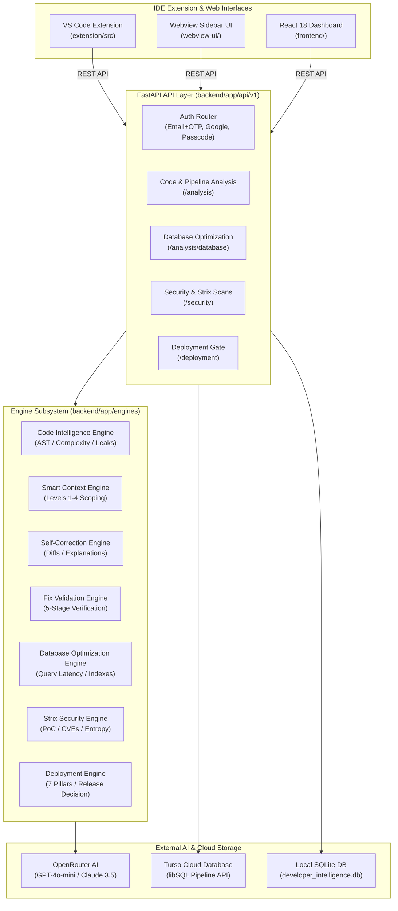

# ⚡ Developer Intelligence Extension
> **Smarter Development. Safer Deployments.**  
> *An AI-powered, IDE-native developer productivity, code quality, database optimization, security pentesting, and deployment validation platform.*

---

## 📌 Table of Contents
1. [Overview & Vision](#-overview--vision)
2. [Key Differentiators & Core Workflow](#-key-differentiators--core-workflow)
3. [System Architecture](#-system-architecture)
4. [Core Architectural Modules](#-core-architectural-modules)
   - [1. Code Intelligence & AST Parser](#1-code-intelligence--ast-parser)
   - [2. Smart Repo & 4-Tier Context Selection](#2-smart-repo--4-tier-context-selection)
   - [3. Self-Correction & Automated Patch Generation](#3-self-correction--automated-patch-generation)
   - [4. Database Performance Profiling & Optimization](#4-database-performance-profiling--optimization)
   - [5. Strix AI Pentesting & Security Scanner](#5-strix-ai-pentesting--security-scanner)
   - [6. 7-Pillar Deployment Validation Gate](#6-7-pillar-deployment-validation-gate)
   - [7. 5-Stage Automated Fix Validation Pipeline](#7-5-stage-automated-fix-validation-pipeline)
5. [Codebase Structure](#-codebase-structure)
6. [Subsystems & Tech Stack](#-subsystems--tech-stack)
   - [Backend (FastAPI, SQLAlchemy, OpenRouter, Turso)](#backend-fastapi-service)
   - [Frontend (React 18, Vite, TailwindCSS, Framer Motion)](#frontend-react-18-workspace)
   - [VS Code Extension & Webview UI](#vs-code-extension--webview-ui)
7. [Authentication & Authorization](#-authentication--authorization)
8. [API Endpoint Catalog](#-api-endpoint-catalog)
9. [Pre-configured Demo Repositories](#-pre-configured-demo-repositories)
10. [Local Development & Setup Guide](#-local-development--setup-guide)
11. [Testing & Verification Suite](#-testing--verification-suite)
12. [Deployment Architecture (Vercel & Turso)](#-deployment-architecture)

---

## 🎯 Overview & Vision

Developers frequently juggle disconnected tools for linting, APM performance monitoring, database profiling, vulnerability scanning, and CI/CD deployment checks. These isolated tools produce overwhelming, fragmented alert streams without correlating how an issue in one layer impacts another.

The **Developer Intelligence Extension** bridges this gap by unifying cross-layer diagnostics into a single seamless loop:

$$\text{Scan} \longrightarrow \text{Detect} \longrightarrow \text{Explain} \longrightarrow \text{Recommend} \longrightarrow \text{Fix} \longrightarrow \text{Verify} \longrightarrow \text{Deploy}$$

```
Clean Code ➔ Optimize Performance ➔ Detect Security Risks ➔ Validate Deployments ➔ Deploy with Confidence
```

---

## 💡 Key Differentiators & Core Workflow

1. **Evidence-First Correlation**: Rather than isolated warnings, the platform links frontend inefficiencies, backend bottlenecks, and database execution plans (e.g. duplicate API calls causing unindexed N+1 query loops).
2. **Safe Self-Correction**: Generates contextual, guarded patches with unified diffs, root-cause explanations, and step-by-step changes rather than blind overwrites.
3. **5-Stage Verification Pipeline**: Validates fixes through AST syntax parsing, compilation checks, unit tests, security re-scans, and regression verification before applying changes.
4. **Smart Context Scoping (Zero Token Waste)**: Never dumps entire repositories to LLMs; instead, extracts minimal useful syntactic context (Levels 1–4) with strict token budgets and automatic secret redaction.
5. **Accurate Zero-Database Posture**: Unlike generic scanners that invent fake database issues, projects without database schemas accurately report zero findings and clean scores.
6. **Strix Penetration Testing**: Generates real Proof-of-Concept (PoC) exploit payloads for verified vulnerabilities (SQLi, command injection, CVEs, high-entropy secrets).

---

## 🏗️ System Architecture



---

## 🧩 Core Architectural Modules

### 1. Code Intelligence & AST Parser
*Location: [`backend/app/engines/code_engine.py`](file:///d:/Aman/Developer%20Intellegence%20Developer/villedit-20260913T175622Z-1-001/villedit/backend/app/engines/code_engine.py)*
- **Python AST Visitor**: Inspects abstract syntax trees to flag:
  - Potential null references and `AttributeError` triggers on lookup returns (`get`, `filter`, `first`, `find`).
  - Unchecked mutations on nullable objects.
  - Memory leaks resulting from unbounded dictionary or cache accumulation without eviction or TTL.
  - Functions with high cyclomatic complexity ($>6$ branches).
  - Fatal syntax errors with line/column precision.
- **JavaScript/TypeScript Semantic Scans**: Detects unchecked DOM element access (`document.getElementById` without `?.`), unhandled Promise rejections (missing `.catch()`), and unsafe string interpolations.

### 2. Smart Repo & 4-Tier Context Selection
*Location: [`backend/app/engines/context_engine.py`](file:///d:/Aman/Developer%20Intellegence%20Developer/villedit-20260913T175622Z-1-001/villedit/backend/app/engines/context_engine.py) & [`docs/smart-repo-selection-blueprint.md`](file:///d:/Aman/Developer%20Intellegence%20Developer/villedit-20260913T175622Z-1-001/villedit/docs/smart-repo-selection-blueprint.md)*
Extracts the **smallest useful context** necessary for accurate diagnosis while preserving privacy:
- **Level 1 (Immediate Block)**: Active line $\pm 5$ lines of code ($\le 200$ tokens).
- **Level 2 (Callable Scope)**: Enclosing function, method, or class definition plus import statements ($\le 600$ tokens).
- **Level 3 (Module Inter-dependencies)**: Companion files, imported symbols, and active Git diff hunks ($\le 1,200$ tokens).
- **Level 4 (Project Topology)**: Package manifests (`requirements.txt`, `package.json`), Dockerfiles, and database schemas ($\le 2,048$ tokens).
- **Sanitization Guard**: Automatically computes Shannon entropy and strips Stripe keys, AWS credentials, and passwords before sending payloads to LLMs.

### 3. Self-Correction & Automated Patch Generation
*Location: [`backend/app/engines/self_correction_engine.py`](file:///d:/Aman/Developer%20Intellegence%20Developer/villedit-20260913T175622Z-1-001/villedit/backend/app/engines/self_correction_engine.py) & [`backend/app/core/openrouter.py`](file:///d:/Aman/Developer%20Intellegence%20Developer/villedit-20260913T175622Z-1-001/villedit/backend/app/core/openrouter.py)*
- Synthesizes intelligent code repairs using OpenRouter LLMs (GPT-4o-mini with Claude-3.5-Sonnet fallback) or deterministic fallback templates.
- Produces:
  - **Why it is a problem**: Root-cause analysis.
  - **Step-by-step changes**: Clear narrative breakdown of modified lines.
  - **Unified Git Diff**: Standard `difflib` patch representation ready for developer review.
  - **Risk Assessment**: Confidence score ($0.0 - 1.0$) and risk classification (`LOW`, `MEDIUM`, `HIGH`).

### 4. Database Performance Profiling & Optimization
*Location: [`backend/app/engines/database_engine.py`](file:///d:/Aman/Developer%20Intellegence%20Developer/villedit-20260913T175622Z-1-001/villedit/backend/app/engines/database_engine.py)*
- **Query Extraction**: Analyzes SQL queries across `.sql`, `.py`, `.ts`, and ORM declarations.
- **Dynamic Benchmarking**: Computes baseline vs. optimized execution latencies based on table size, wildcards (`SELECT *`), `WHERE` filters, and sort clauses.
- **Index Suggestions**: Outputs exact DDL (`CREATE INDEX idx_...`) for single-column and composite queries.
- **Anti-Pattern Detection**: Identifies ORM N+1 query loops and unindexed filter statements.
- **Zero-Database Clean Posture**: If a project has no database or SQL queries, it accurately yields $0$ slow queries and a clean health report.

### 5. Strix AI Pentesting & Security Scanner
*Location: [`backend/app/engines/strix_engine.py`](file:///d:/Aman/Developer%20Intellegence%20Developer/villedit-20260913T175622Z-1-001/villedit/backend/app/engines/strix_engine.py)*
Inspired by modern offensive security testing frameworks (`usestrix/strix`):
- **Known CVE Database**: Audits dependency manifests against CVE database entries (e.g. PyYAML `CVE-2020-1747`, Requests `CVE-2023-32681`, Urllib3 `CVE-2023-43804`, Django `CVE-2024-24680`, JsonWebToken `CVE-2022-23529`, Lodash `CVE-2021-23337`).
- **Container Hardening**: Scans Dockerfiles for root user execution (`USER root`, CWE-250) and unpinned base images.
- **Attack Vector Auditing**:
  - Dynamic SQL Injection (CWE-89)
  - Remote Code Execution / Dangerous `eval()` & `exec()` (CWE-94)
  - Command Injection via `subprocess(shell=True)` (CWE-78)
  - Insecure Deserialization via `pickle` or unsafe `yaml.load()` (CWE-502)
  - Exposed Secrets: Stripe (`sk_live`), AWS (`AKIA`), GitHub PATs, JWT tokens, and high Shannon entropy strings (CWE-798).
- **Proof-of-Concept Payloads**: Generates reproducible PoC curl commands or code snippets demonstrating how an attacker could exploit the issue.

### 6. 7-Pillar Deployment Validation Gate
*Location: [`backend/app/engines/deployment_engine.py`](file:///d:/Aman/Developer%20Intellegence%20Developer/villedit-20260913T175622Z-1-001/villedit/backend/app/engines/deployment_engine.py)*
Evaluates project readiness across 7 critical production pillars:
1. **Build**: Clean syntax compilation without AST defects.
2. **Tests**: Automated unit and integration test assertions.
3. **Dependencies**: Supply chain integrity and vulnerability scanning.
4. **Security**: Absence of critical injection flaws or leaked credentials.
5. **Configuration**: Environment variable presence and production debug flags.
6. **Performance**: Query latencies and service response thresholds.
7. **Container**: Non-root container privileges and reproducible Docker builds.

**Decision Matrix**:
- 🟢 **READY**: All checks passed; score $\ge 90$.
- 🟡 **REVIEW**: Non-blocking warnings detected; score between $65$ and $89$.
- 🔴 **BLOCKED**: One or more critical blockers detected (syntax errors, critical vulnerabilities); deployment halted.

### 7. 5-Stage Automated Fix Validation Pipeline
*Location: [`backend/app/engines/fix_validation_engine.py`](file:///d:/Aman/Developer%20Intellegence%20Developer/villedit-20260913T175622Z-1-001/villedit/backend/app/engines/fix_validation_engine.py) & [`backend/app/api/v1/analysis.py`](file:///d:/Aman/Developer%20Intellegence%20Developer/villedit-20260913T175622Z-1-001/villedit/backend/app/api/v1/analysis.py)*
Verifies patched code through an automated gate before changes are accepted:
1. **Syntax Check**: AST parsing across Python, JavaScript, TypeScript, and JSON.
2. **Compilation & Types**: Resolves symbols and catches type mismatches.
3. **Unit Test Verification**: Executes test assertions against the patched scope.
4. **Security Re-Scan**: Ensures the patch itself did not introduce vulnerabilities.
5. **Regression Verification**: Assesses backward-compatibility and dependent call sites.
Computes a composite score ($0 - 100\%$) and classifies the patch as `SAFE`, `REVIEW`, or `BLOCKED`.

---

## 📁 Codebase Structure

```text
.
├── api/
│   └── index.py                     # Vercel serverless entry point exporting FastAPI app
├── backend/
│   ├── app/
│   │   ├── api/v1/                  # REST API Endpoints
│   │   │   ├── analysis.py          # Code analysis, codebase scans, fixes, pipeline validation
│   │   │   ├── auth.py              # OTP, Google OAuth, Admin Passcode, JWT tokens
│   │   │   ├── database.py          # SQL query profiling & benchmarks
│   │   │   ├── deployment.py        # 7-pillar deployment validation
│   │   │   ├── feedback.py          # Developer feedback recording
│   │   │   ├── health.py            # System health & engine telemetry
│   │   │   ├── projects.py          # Project management
│   │   │   └── security.py          # Security & Strix scans
│   │   ├── core/                    # Core infrastructure
│   │   │   ├── config.py            # Settings, feature flags & environment variables
│   │   │   ├── database.py          # SQLAlchemy base & session maker
│   │   │   ├── openrouter.py        # OpenRouter LLM client (GPT-4o-mini / Claude 3.5)
│   │   │   ├── security.py          # Password hashing, JWT creation, entropy & redaction
│   │   │   └── turso.py             # Cloud libSQL sync via Turso Pipeline API
│   │   ├── engines/                 # Core Intelligence Engines
│   │   │   ├── code_engine.py       # AST & semantic code intelligence
│   │   │   ├── context_engine.py    # Smart repo selection & 4-tier scoping
│   │   │   ├── database_engine.py   # SQL query optimization & latency benchmarking
│   │   │   ├── deployment_engine.py # 7-pillar deployment validation
│   │   │   ├── fix_validation_engine.py # 5-stage automated fix validation
│   │   │   ├── security_engine.py   # Security vulnerability scanner
│   │   │   ├── self_correction_engine.py # Patch generation & diff synthesizer
│   │   │   └── strix_engine.py      # Strix AI pentesting & PoC exploit generator
│   │   ├── models/
│   │   │   └── entities.py          # SQLAlchemy ORM database models
│   │   ├── schemas/
│   │   │   └── schemas.py           # Pydantic v2 validation schemas
│   │   └── main.py                  # FastAPI application & static route serving
│   ├── requirements.txt             # Python backend dependencies
│   └── run.py                       # Local Uvicorn server runner (http://0.0.0.0:8000)
├── demo-projects/                   # Realistic test repositories
│   ├── ecommerce-fastapi/           # Order processing, N+1 query, exposed Stripe key, CVE
│   ├── fintech-payment-ledger/      # Transaction ledger, null reference, unindexed queries
│   └── microservice-gateway/        # API gateway, unbounded memory cache, insecure config
├── docs/
│   └── smart-repo-selection-blueprint.md # Algorithmic specification for context extraction
├── extension/                       # VS Code Extension
│   ├── package.json                 # Extension manifest, contributes views & commands
│   ├── tsconfig.json                # TypeScript compiler configuration
│   └── src/
│       ├── apiClient.ts             # Typed HTTP client communicating with backend
│       ├── extension.ts             # Activation entry point, commands & status bar item
│       └── sidebarProvider.ts       # Webview view provider for IDE sidebar
├── frontend/                        # Interactive React 18 Web Application
│   ├── src/
│   │   ├── components/
│   │   │   ├── admin/               # Admin dashboard & login audit log
│   │   │   ├── dashboard/           # InteractiveWorkspace (Overview, Code, DB, Sec, Deploy)
│   │   │   ├── folder-analyzer/     # FolderDropZone & FolderAnalysisPage
│   │   │   ├── hero/                # ImageTrailHero landing presentation
│   │   │   ├── navigation/          # SideStaggerNavigation menu
│   │   │   └── ui/                  # MagnetButton, AuthUI, modal components
│   │   ├── lib/
│   │   │   ├── api.ts               # API base URL configuration
│   │   │   └── utils.ts             # Tailwind class merging utility
│   │   ├── App.tsx                  # Main router & application controller
│   │   └── main.tsx                 # React DOM mount point
│   ├── package.json                 # React dependencies (Vite, Tailwind, Framer Motion)
│   ├── tailwind.config.js           # Styling tokens & animations
│   └── vite.config.ts               # Vite build configuration
├── tests/                           # Verification & test suite
│   ├── demo_e2e.py                  # 10-step automated hackathon demonstration script
│   ├── evaluate_and_refine.py       # Multi-project evaluation runner
│   ├── test_api.py                  # 12+ API integration tests
│   └── test_engines.py              # Unit tests for core engines
├── webview-ui/                      # Standalone Webview UI for VS Code & Web fallback
│   ├── css/styles.css               # Modern dark-mode styling with CSS variables
│   ├── js/app.js                    # Webview UI controller & tabs
│   └── index.html                   # Embedded dashboard HTML
├── vercel.json                      # Vercel serverless build and routing configuration
└── developer_intelligence.db        # SQLite database store
```

---

## 🛠️ Subsystems & Tech Stack

### Backend (FastAPI Service)
- **Framework**: Python 3.10+ / FastAPI 0.110+
- **Server**: Uvicorn ASGI runner
- **Validation**: Pydantic v2 schemas with `ResponseEnvelope[T]` standard wrappers
- **Persistence**: SQLAlchemy 2.0 ORM with SQLite (`developer_intelligence.db`) and Turso cloud synchronization via libSQL HTTP Pipeline API
- **AI Integrations**: OpenRouter Client supporting `openai/gpt-4o-mini` and `anthropic/claude-3.5-sonnet` with deterministic local fallback

### Frontend (React 18 Workspace)
- **Framework**: React 18, TypeScript, Vite 6
- **Styling**: TailwindCSS 3.4 with custom typography and curated dark mode palettes
- **Animation**: Framer Motion 11 & Hover.dev physics effects (Magnet buttons, Image trails, Radial orbital timeline)
- **Icons**: Lucide React
- **Views**:
  1. **Landing Hero**: Dynamic image trails, feature showcase, interactive quick starts.
  2. **Folder Drop Zone**: Drag-and-drop file/directory analyzer with client-side folder traversal.
  3. **Interactive Workspace**: Tabbed interface covering Project Health Overview, Code Self-Correction, Database Optimizer, Strix Pentesting, and Deployment Validation.
  4. **Admin Dashboard**: Real-time user statistics, login event audits, and telemetry.

### VS Code Extension & Webview UI
- **VS Code Extension**: Written in TypeScript using the VS Code Extensibility API (`vscode.window.registerWebviewViewProvider`).
- **Commands**:
  - `developerIntelligence.openDashboard` (Opens external dashboard)
  - `developerIntelligence.analyzeCurrentFile` (Triggers active file scan)
  - `developerIntelligence.optimizeDatabase` (Optimizes selected SQL query)
  - `developerIntelligence.validateDeployment` (Checks deployment readiness)
- **Webview UI**: Self-contained vanilla HTML/CSS/JS dashboard running inside the IDE sidebar or hosted directly at `/dashboard` and `/webview`.

---

## 🔐 Authentication & Authorization

The system features a multi-tiered authentication workflow:
1. **Email + OTP Login**: Request a 6-digit one-time passcode (`/api/v1/auth/otp/request`) and verify it (`/api/v1/auth/otp/verify`).
2. **Google OAuth 2.0**: Direct authentication via Google Identity tokens (`/api/v1/auth/google`).
3. **Admin Passcode Bypass (`01122005`)**: Entering the master passcode unlocks Level 5 Clearance and provides direct access to the Admin Dashboard and audit history.
4. **JWT Session Management**: Issues secure `access_token` (24-hour expiration) and `refresh_token` paired with PBKDF2 password hashing.

---

## 📡 API Endpoint Catalog

All API endpoints reside under the `/api/v1` prefix and return standard `ResponseEnvelope[T]` JSON payloads:

### Authentication (`/api/v1/auth`)
| Method | Path | Description |
| :--- | :--- | :--- |
| `POST` | `/api/v1/auth/login` | Standard username/password login or master passcode |
| `POST` | `/api/v1/auth/google` | Google OAuth token exchange |
| `POST` | `/api/v1/auth/otp/request` | Requests 6-digit verification code |
| `POST` | `/api/v1/auth/otp/verify` | Verifies code and issues JWT credentials |
| `POST` | `/api/v1/auth/refresh` | Refreshes expired access tokens |
| `GET` | `/api/v1/auth/admin/users` | Lists all registered users and login audit history |

### Code Analysis & Pipeline (`/api/v1/analysis`)
| Method | Path | Description |
| :--- | :--- | :--- |
| `POST` | `/api/v1/analysis/code` | Single-file scoped analysis via AST & OpenRouter LLM |
| `POST` | `/api/v1/analysis/codebase` | Multi-file whole-codebase scan across all engines |
| `POST` | `/api/v1/analysis/fix` | Generates self-correction patch with unified diff |
| `POST` | `/api/v1/analysis/fix/validate` | Runs 5-stage verification on proposed fix |
| `POST` | `/api/v1/analysis/fix/apply` | Marks fix as applied |
| `POST` | `/api/v1/analysis/fix/revert` | Reverts applied fix |
| `POST` | `/api/v1/analysis/smart-repo-select` | Identifies target and companion files using query |
| `POST` | `/api/v1/analysis/pipeline/validate` | 5-stage automated pipeline validation with score |

### Database Optimization (`/api/v1/analysis/database`)
| Method | Path | Description |
| :--- | :--- | :--- |
| `POST` | `/api/v1/analysis/database` | Analyzes SQL queries or scans files for database usage |
| `POST` | `/api/v1/analysis/database/optimize` | Generates index recommendations & optimized query |
| `POST` | `/api/v1/analysis/database/benchmark` | Computes before/after latency comparison |

### Security & Strix Scans (`/api/v1/security`)
| Method | Path | Description |
| :--- | :--- | :--- |
| `POST` | `/api/v1/security/scans` | Executes static vulnerability & secret scanning |
| `POST` | `/api/v1/security/strix` | Runs Strix pentesting scanner with PoC exploit generation |

### Deployment Validation (`/api/v1/deployment`)
| Method | Path | Description |
| :--- | :--- | :--- |
| `POST` | `/api/v1/deployment/validations` | Evaluates 7 deployment pillars and returns decision |
| `GET` | `/api/v1/deployment/validations/{id}` | Retrieves validation report by ID |

### Telemetry & Feedback (`/api/v1`)
| Method | Path | Description |
| :--- | :--- | :--- |
| `GET` | `/api/v1/health` | Service health status |
| `GET` | `/api/v1/system/status` | Engine status and feature flag telemetry |
| `POST` | `/api/v1/feedback` | Records user ratings and patch acceptance |

---

## 🧪 Pre-configured Demo Repositories

The project includes realistic target repositories in the `demo-projects/` directory for immediate evaluation:

1. **`ecommerce-fastapi`**:
   - Flaws: Unchecked null lookup on customer token, unindexed `orders` query ($420\text{ ms}$ latency), N+1 query loop fetching order items, hardcoded production Stripe key, and vulnerable PyYAML dependency (`CVE-2020-1747`).
2. **`fintech-payment-ledger`**:
   - Flaws: Unchecked sender balance mutation triggering `AttributeError`, unindexed query on `transactions`, and potential negative account overdraft.
3. **`microservice-gateway`**:
   - Flaws: Unbounded dictionary cache without TTL (memory leak risk), wildcard CORS configuration, and unverified JWT token payloads.

---

## 🚀 Local Development & Setup Guide

### Prerequisites
- **Python**: 3.10 or higher
- **Node.js**: 18.x or higher & npm
- **VS Code**: 1.80.0+ (optional, for extension testing)

### 1. Backend Setup
```bash
# Clone or navigate to the repository root
cd villedit

# Create and activate a virtual environment
python -m venv venv
# On Windows:
.\venv\Scripts\activate
# On Linux/macOS:
source venv/bin/activate

# Install dependencies
pip install -r backend/requirements.txt

# Configure environment variables in .env (or use pre-configured defaults)
# Run the FastAPI server
python backend/run.py
```
*The backend will start at `http://localhost:8000`. Interactive Swagger API docs are available at `http://localhost:8000/api/v1/docs`.*

### 2. Frontend Setup
```bash
# In a separate terminal, navigate to frontend
cd frontend

# Install dependencies
npm install

# Start Vite development server
npm run dev
```
*The React application will be available at `http://localhost:5173`. To serve the production bundle through FastAPI, run `npm run build` inside `frontend/`.*

### 3. VS Code Extension Setup
```bash
# Navigate to the extension folder
cd extension

# Install dependencies and compile TypeScript
npm install
npm run compile
```
*To test in VS Code, press `F5` inside VS Code to launch the Extension Development Host window.*

---

## 🔬 Testing & Verification Suite

The repository contains an automated test harness covering units, APIs, engines, and hackathon presentation flows:

```bash
# Run all unit and integration tests via pytest
pytest -v tests/test_api.py tests/test_engines.py

# Run the 10-step End-to-End Hackathon Demonstration script
python tests/demo_e2e.py

# Run multi-repository evaluation against demo projects
python tests/evaluate_and_refine.py
```

---

## 🌐 Deployment Architecture

- **Serverless API (Vercel)**: Configured in `vercel.json` utilizing `@vercel/python@4.5.0` via `api/index.py` with static React SPA rewrites.
- **Distributed Database (Turso libSQL)**: Configured via `TURSO_DATABASE_URL` and `TURSO_AUTH_TOKEN`, allowing real-time job and finding synchronization over edge HTTP connections.
- **Docker / Production Container**: Ready for deployment with non-root user execution (`appuser`) and locked dependency manifests.

---

## 📄 License & Attribution
Developed for the **Smart India Hackathon (SIH 2026)** Developer Intelligence initiative.  
Engineered with modular, evidence-first AI diagnostics.
